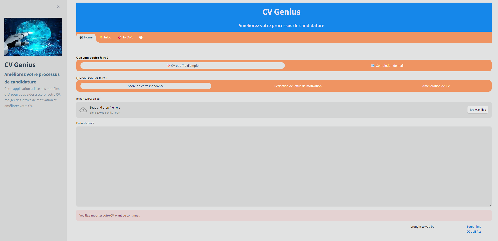

# CV Genius

CV Genius est une application web Streamlit utilisant l'IA pour assister les utilisateurs dans leur processus de candidature. Elle offre des fonctionnalités telles que le scoring de CV, la génération de lettres de motivation et l'amélioration de CV.


[Lien vers l'application](https://extia-cvgenius.streamlit.app/)

## Fonctionnalités

- **Scoring CV/Offre d'emploi multi-critères** (voir ci-dessous)
- Génération de lettre de motivation
- Amélioration de CV
- Complétion de mail

## Moteur de scoring multi-critères

Le scoring repose sur un moteur hybride (`scr/scoring`) qui agrège plusieurs
sous-scores pondérés en un score global explicable, plutôt que sur un unique
appel LLM en texte libre :

| Critère | Méthode | Description |
| --- | --- | --- |
| Compétences | Déterministe (ATS) | Couverture des mots-clés exigés par l'offre |
| Similarité sémantique | Déterministe (TF-IDF) | Recouvrement global CV / offre |
| Expérience | Déterministe | Ancienneté détectée vs. exigence de l'offre |
| Séniorité | Déterministe | Alignement des marqueurs de niveau |
| Formation | Déterministe | Diplômes et certifications |
| Qualitatif | LLM (optionnel) | Soft skills, cohérence du parcours |

Caractéristiques :

- **Reproductible et sans réseau** par défaut (mode déterministe).
- **Explicable** : score par critère, justification, points forts/faibles.
- **Extensible** : le calculateur de similarité (`SimilarityProvider`) et le
  LLM (`LanguageModel`) sont injectables (embeddings, autres modèles...).
- **Pondération configurable** via `ScoringWeights` (renormalisée à somme 1).

Exemple :

```python
from scr.scoring import MultiCriteriaScoringEngine

engine = MultiCriteriaScoringEngine()
result = engine.score(resume_text, job_advert_text)
print(result.global_score, result.band_label)
```

## Prérequis

- Python 3.8+
- Dépendances du fichier `requirements.txt`
- Jeton d'API Hugging Face

## Installation

1. Cloner le dépôt :

```bash
git clone https://huggingface.co/spaces/bourahima/CvGeniusAI
```

2. Installez les dépendances :

```bash
pip install -r requirements.txt
```

3. Configurer le jeton API :
Créez un fichier `.env` à la racine du projet avec :

```txt
huggingface_api_key=YOUR_API_TOKEN
```

## Utilisation

1. Lancer l'application :

```bash
streamlit run app.py
```

2. Suivre les instructions dans l'interface utilisateur.

## Contribution

1. Forker le dépôt
2. Créer une branche (`git checkout -b feature/nouvelle-fonctionnalite`)
3. Commiter les changements (`git commit -am 'Ajoute une nouvelle fonctionnalité'`)
4. Pousser la branche (`git push origin feature/nouvelle-fonctionnalite`)
5. Ouvrir une Pull Request
